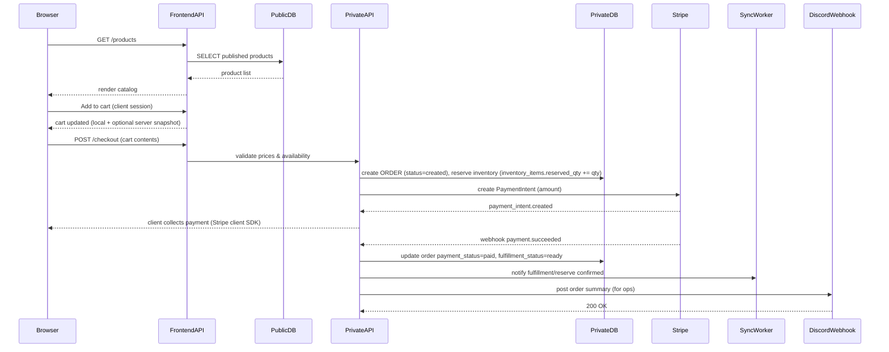
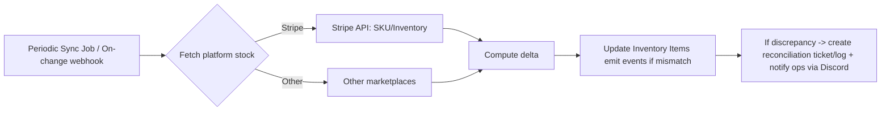

# Diagrams

## Data Flow Diagram

```mermaid
sequenceDiagram
  participant Browser
  participant FrontendAPI
  participant CatalogDB as PublicDB
  participant PrivateAPI
  participant OrdersDB as PrivateDB
  participant Stripe
  participant InventorySync as SyncWorker
  participant Discord as DiscordWebhook

  Browser->>FrontendAPI: GET /products
  FrontendAPI->>CatalogDB: SELECT published products
  CatalogDB-->>FrontendAPI: product list
  FrontendAPI-->>Browser: render catalog

  Browser->>FrontendAPI: Add to cart (client session)
  FrontendAPI-->>Browser: cart updated (local + optional server snapshot)

  Browser->>FrontendAPI: POST /checkout (cart contents)
  FrontendAPI->>PrivateAPI: validate prices & availability
  PrivateAPI->>OrdersDB: create ORDER (status=created), reserve inventory (inventory_items.reserved_qty += qty)
  PrivateAPI->>Stripe: create PaymentIntent (amount)
  Stripe-->>PrivateAPI: payment_intent.created
  PrivateAPI-->>Browser: client collects payment (Stripe client SDK)

  Stripe-->>PrivateAPI: webhook payment.succeeded
  PrivateAPI->>OrdersDB: update order payment_status=paid, fulfillment_status=ready
  PrivateAPI->>InventorySync: notify fulfillment/reserve confirmed
  PrivateAPI->>Discord: post order summary (for ops)
  Discord-->>PrivateAPI: 200 OK


```

## Inventory Sync

```mermaid
flowchart LR
  A[Periodic Sync Job / On-change webhook] --> B{Fetch platform stock}
  B -->|Stripe| C[Stripe API: SKU/Inventory]
  B -->|Other| D[Other marketplaces]
  C --> E[Compute delta]
  D --> E
  E --> F[Update Inventory Items emit events if mismatch]
  F --> G[If discrepancy -> create reconciliation ticket/log + notify ops via Discord]
```
